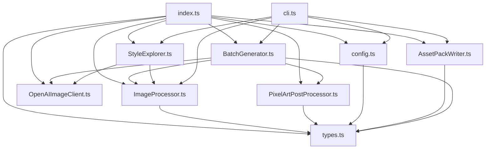

# Context: restyle-sprites

This project was extracted from the asset restyling tooling in Modern Wumpus and turned into a standalone npm package. The goal of the extraction was to keep the same pixel-art restyling core while making it engine-agnostic and reusable across different game projects.

`CONTEXT.md` is intentionally static background and architecture orientation. Iterative project decisions live in `DECISIONS.md`, implementation specifics live as inline TSDoc in `src/`.

## Architecture Overview

## Reading Order

- **AI agents**: Start with [`AGENTS.md`](./AGENTS.md) — it is the primary entry point and links to everything else.
- **Human contributors**: Start with [`README.md`](./README.md) for product-level usage, then [`CONTRIBUTING.md`](./CONTRIBUTING.md).
- **Deeper context**: `ROADMAP.md` → `DECISIONS.md` → `src/*.ts` (inline TSDoc is source of truth).
